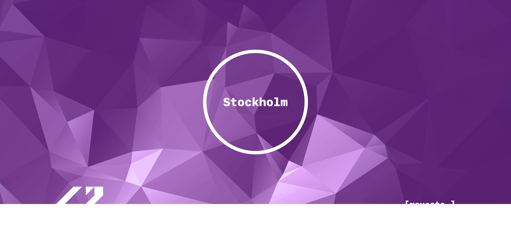

<!-- PROJECT LOGO -->
<br />
<p align="center">
  <a href="https://elearning.intra.42.fr/assets/42_logo-7dfc9110a5319a308863b96bda33cea995046d1731cebb735e41b16255106c12.svg">
    
  </a>

  <p align="center">
    Haz el mal con fines educativos
    <br />
    <a style="color:#874EA0" href="https://cdn.intra.42.fr/pdf/pdf/55314/es.subject.pdf"><strong>Explore the subject »</strong></a>
    <br />
    <br />
    <a style="color:#874EA0" href="https://github.com/raqelcb/stockholm">stockholm</a>
    ·
    <a style="color:#874EA0" href="https://github.com/raqelcb/ft_onion">ft_onion</a>
    ·
    <a style="color:#874EA0" href="https://github.com/raqelcb/vaccine">vaccine</a>
	·
	<a style="color:#874EA0" href="https://github.com/raqelcb/xxx">xxx</a>
  </p>
</p>
<br>
<!-- TABLE OF CONTENTS -->
<!-- <details open="open"> -->
  <summary><h2 style="display: inline-block">Table of Contents</h2></summary>
  <ul>
    <li>
      <a style="color:#874EA0" href="#about-the-project">About The Project</a>
      <ul>
        <li><a style="color:#874EA0" href="#parts-of-the-project">Parts of the project</a></li>
        <li><a style="color:#874EA0" href="#list-of-rules">List of rules</a></li>
      </ul>
    </li>
    <li>
      <a style="color:#874EA0" href="#usage">Usage</a>
    </li>
    <li><a style="color:#874EA0" href="#license">License</a></li>
  </ul>
</details>

<br>

<!-- ABOUT THE PROJECT -->
## About The Project

This project will make you sort data on a stack, with a limited set of instructions, using the lowest possible number of actions. To succeed you’ll have to manipulate various types of algorithms and choose the one (of many) most appropriate solution for an optimized data sorting.
`42-cursus`, `push_swap`
<br>

### Parts of the project

* [X] **Rules:** xxxx
* [X] **Checker:** xxxx

<br>


### List of rules
There are 2 stacks named a and b and the goal is to sort in ascending order numbers into stack a.

- To start with:

	- a contains a random number of either positive or negative numbers without any duplicates.
	- is empty

- To do this push_swap program has the following operations:

	- sa : Estará desarrollado para la plataforma Linux o MacOS.
• Solo actuará sobre una carpeta infection en el directorio HOME del usuario.
• El programa actuará solo sobre los archivos con las extensiones que fueron afectadas por Wannacry.
• Incluirás un archivo de no más de 50 líneas llamado README.md con las instruc- ciones de uso y, si fueran requeridas, para compilarlo.
• En caso de lenguaje compilado, incluirás todo el código fuente del programa.
• El programa renombrará todos los archivos de la carpeta mencionada añadiendo la
extensión ".ft".
• En caso de que ya tuvieran dicha extensión, no se renombrarán.
• Los archivos serán cifrados con un algoritmo conocido de tu elección, que sea con- siderado seguro.
• La clave con la que se cifren los archivos será de una longitud de al menos 16 caracteres.
• El programa contará con la opción -help.o h"para mostrar la ayuda.
• El programa contará con la opción -version.o v"para mostrar la versión del programa.
• El programa contará con la opción -reverse.o r"seguida de la clave introducida como argumento para revertir la infección.
• El programa mostrará cada archivo cifrado durante el proceso salvo que se indique la opción -silent.o s", en cuyo caso el programa no producirá ningún output.
• El programa manejará los errores y no se detendrá inesperadamente en ningún caso.

<!-- INSTALLATION -->
## Usage

To get a local copy up and running follow these simple steps.


1. Clone the repo
   ```sh
   git clone https://github.com/raqelcb/push_swap.git
   ```
2. Run `make` (rules: `all, clean, fclean, re`)
   ```sh
   make
   ```
3. Execute
   ```c
   ./push_swap 2 1 3 6 5 8
   ```

<br>

<!-- LICENSE -->
## License

Distributed under the
[MIT](https://choosealicense.com/licenses/mit/) License. See `LICENSE` for more information.

<br>

[](https://github.com/rcuesta-/badge42)
